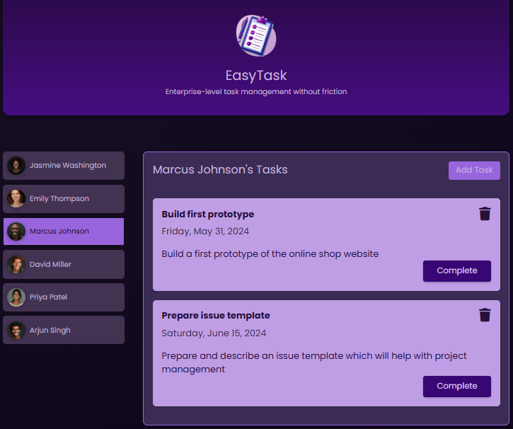

# 🧾 EasyTask

> 📘 This README is also available in [English](./README.md).

**EasyTask** é uma aplicação de gerenciamento de tarefas desenvolvida com Angular, que permite visualizar, adicionar, concluir e excluir tarefas por usuário. Criado como parte do curso *Angular - The Complete Guide (2025 Edition)*, o projeto utiliza conceitos modernos como `signals`, serviços reativos e `content projection`.

> 🌐 Acesse a demonstração online em: [https://dihcoder.github.io/easy-task](https://dihcoder.github.io/easy-task)



---

## ✨ Funcionalidades

* Alternar entre diferentes usuários com tarefas separadas
* Adicionar novas tarefas
* Marcar tarefas como concluídas
* Excluir tarefas
* Armazenamento persistente com **localStorage**

---

## 🧠 Conceitos Angular Utilizados

* `@Input()` e `@Output()` com `signals`
* `ng-content` para projeção de conteúdo
* Estado reativo com `signal` e `computed`
* Comunicação entre componentes
* Services compartilhados com `@Injectable()`
* Componentização modular e reutilizável
* Boas práticas de estrutura por **feature**
* Pipes (`date`)

---

## 🛠️ Tecnologias

* [Angular](https://angular.io/) v19.1
* TypeScript
* HTML/CSS
* TailwindCSS (uso parcial e progressivo)
* localStorage (Web Storage API)

---

## 📁 Estrutura de Pastas

```bash
src/
├── app/
│   ├── core/
│   │   └── services/
│   │       ├── task.service.ts
│   │       └── user.service.ts
│   ├── features/
│   │   ├── tasks/
│   │   │   ├── add-task/         # Formulário para adicionar tarefas
│   │   │   ├── task/             # Componente de tarefa individual + task.model.ts
│   │   │   ├── tasks.component.*
│   │   └── user-list/
│   │       ├── user/             # Componente de usuário individual + user.model.ts
│   │       ├── user-list.component.*
│   └── shared/
│       ├── card/                # Componente de layout reutilizável
│       └── header/              # Cabeçalho da aplicação
├── assets/
│   ├── users/                   # Imagens de usuários
│   └── task-management-logo.png
```

> A estrutura é baseada no padrão **Core + Features + Shared**, promovendo escalabilidade e organização modular.

---

## 🎨 Estilização

* A base da estilização é feita com **CSS puro**.
* O projeto já inclui o TailwindCSS como dependência para futura migração e aplicação de utilitários.
* Estilização responsiva e moderna, com componentes reaproveitáveis.

---

## ▶️ Como Executar Localmente

```bash
# Clone o repositório
git clone https://github.com/dihcoder/easy-task.git
cd easy-task

# Instale as dependências
npm install

# Rode o servidor de desenvolvimento
ng serve
```

Acesse em: [http://localhost:4200](http://localhost:4200)

---

## 📚 Objetivo do Projeto

Esse projeto foi desenvolvido com fins educacionais, como parte do curso de Angular da [Udemy](https://www.udemy.com/) ministrado por [Maximilian Schwarzmüller](https://www.udemy.com/course/the-complete-guide-to-angular-2/). Seu propósito é consolidar a arquitetura moderna Angular, práticas recomendadas e recursos atualizados da framework.

---

## 🧑‍💻 Autor

**Diego Silva**
Entusiasta de tecnologia apaixonado por desenvolvimento e design.
[GitHub: @dihcoder](https://github.com/dihcoder)
